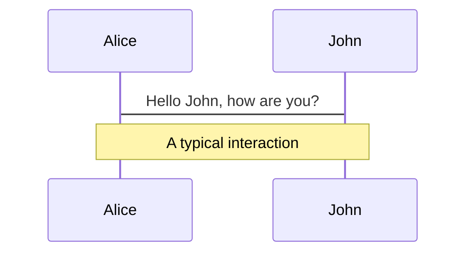
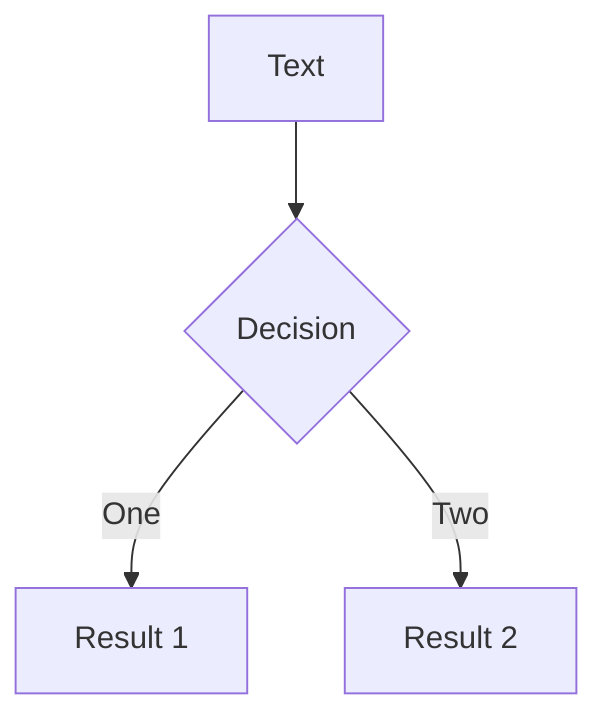
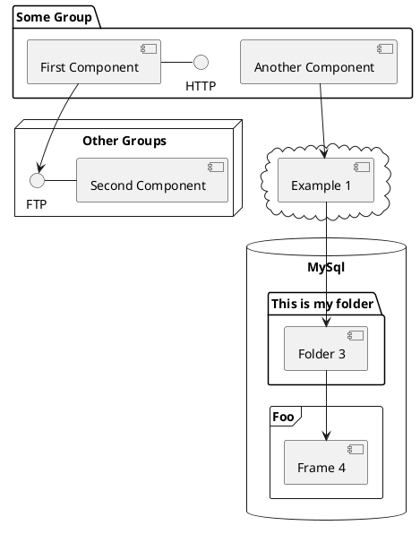

---
# try also 'default' to start simple
theme: seriph
# random image from a curated Unsplash collection by Anthony
# like them? see https://unsplash.com/collections/94734566/slidev
background: https://source.unsplash.com/collection/94734566/1920x1080
# apply any windi css classes to the current slide
class: 'text-center'
# https://sli.dev/custom/highlighters.html
highlighter: shiki
# show line numbers in code blocks
lineNumbers: false
# some information about the slides, markdown enabled
info: |
  ## Slidev Starter Template
  Presentation slides for developers.

  Learn more at [Sli.dev](https://sli.dev)
# persist drawings in exports and build
drawings:
  persist: false
# use UnoCSS
css: unocss
---

# Nextチュートリアルで覚えるNuxt3

<div class="flex justify-center items-center"><p class="ml-1 text-gray-400">ushironoko</p></div>

<div class="abs-br m-6 flex gap-2">
  <button @click="$slidev.nav.openInEditor()" title="Open in Editor" class="text-xl icon-btn opacity-50 !border-none !hover:text-white">
    <carbon:edit />
  </button>
</div>

---

# 自己紹介


<br>

- 📝 **name** - ushironoko
- <carbon-logo-github /> **GitHub** - ushironoko
- <carbon-logo-twitter /> **Twitter** - @ushiro_noko
- 🖋️ **Blog** - ushironoko.me
- 🛠️ **Works** - STORES, inc. & NuxtLabs Japan by ZEN Advisor

<style>
h1 {
  background-image: linear-gradient(45deg, #4EC5D4 10%, #146b8c 20%);
  -webkit-background-clip: text;
  -moz-background-clip: text;
  -webkit-text-fill-color: transparent;
  -moz-text-fill-color: transparent;
}
</style>

---

# 目次

- Nextチュートリアルとは
- Nuxt3とは
- 本日のゴール
- 実践

<style>
h1 {
  background-image: linear-gradient(45deg, #4EC5D4 10%, #146b8c 50%);
  -webkit-background-clip: text;
  -moz-background-clip: text;
  -webkit-text-fill-color: transparent;
  -moz-text-fill-color: transparent;
}
</style>

---

# Nextチュートリアルとは

### Next.js Learn

https://nextjs.org/learn/basics/create-nextjs-app

- Next.js公式のチュートリアル
- Next.jsのさまざまな基本機能を一通り触りながら覚えられる
- 最終的にVercelへ自作のmarkdownベースブログをデプロイできる


<style>
h1 {
  background-image: linear-gradient(45deg, #4EC5D4 10%, #146b8c 50%);
  -webkit-background-clip: text;
  -moz-background-clip: text;
  -webkit-text-fill-color: transparent;
  -moz-text-fill-color: transparent;
}
</style>

---

# Nuxt3とは

https://nuxt.com/

- Nuxt.jsの最新版
- Vueのフル機能をサポート
- ファイルベースルーティング、ページ毎のCSR/SSR/SSG/ISR(G)
- Vite or Webpack5
- esbuild transpiling
- Zero-Config TypeScript Support
- Node.js/Deno/Edge Functions/Workerなどさまざまな環境で動作する
- auto-imports,特定ディレクトリ配下のd.tsの自動生成
- やっと出た(betaから1年)


<style>
h1 {
  background-image: linear-gradient(45deg, #4EC5D4 10%, #146b8c 50%);
  -webkit-background-clip: text;
  -moz-background-clip: text;
  -webkit-text-fill-color: transparent;
  -moz-text-fill-color: transparent;
}
</style>

---

# 本日のゴール

https://nuxt.com/

- Nextチュートリアルを実践形式でNuxtに置き換えながら見せます
- Vercel…ではなくCloudflare Pagesへデプロイ(推しなので)
- 時間の都合で一部簡略化します

<style>
h1 {
  background-image: linear-gradient(45deg, #4EC5D4 10%, #146b8c 50%);
  -webkit-background-clip: text;
  -moz-background-clip: text;
  -webkit-text-fill-color: transparent;
  -moz-text-fill-color: transparent;
}
</style>

---
layout: center
class: text-center
---

<p class="text-[150px]">実演</p>

---

# プロジェクト生成&インストール

1. `nuxi` コマンドでスキャフォールド。

```shell
npx nuxi init pwa-night-ushironoko-demo
```

2. 移動

```shell
cd pwa-night-ushironoko-demo
```

3. 依存のインストール

```shell
yarn install
```

4. サーバー起動

```shell
yarn dev
```

<style>
h1 {
  background-image: linear-gradient(45deg, #4EC5D4 10%, #146b8c 50%);
  -webkit-background-clip: text;
  -moz-background-clip: text;
  -webkit-text-fill-color: transparent;
  -moz-text-fill-color: transparent;
}
</style>

---

# 構成の確認

- `.nuxt`: 自動生成した型や、サーバーの起動に必要な情報などが格納される
- `app.vue`: エントリーポイントとなるコンポーネント
- `nuxt.config.ts`: Nuxtの設定を記述するファイル
- `tsconfig.json`: `.nuxt` 配下の `tsconfig.json` をextendしている

## ポイント
- `.nuxt` 配下の型情報を用いてauto importsの型を効かせる
- `.nuxt` を再生成するときは `yarn postinstall`


<style>
h1 {
  background-image: linear-gradient(45deg, #4EC5D4 10%, #146b8c 50%);
  -webkit-background-clip: text;
  -moz-background-clip: text;
  -webkit-text-fill-color: transparent;
  -moz-text-fill-color: transparent;
}
</style>

---

# pages/index.vueを作る

1. `app.vue` を消す
2. `pages/index.vue` を作る

pages/index.vue
```vue
<template>
  <h1>First post</h1>
</template>
```

<br>

### ポイント
- `app.vue` か `pages/index.vue` をエントリーポイントにする
  - 単一のページ(LPなど)は `app.vue`、そうでない場合は `pages/index.vue`
  - `app.vue` を使うとバンドルから `vue-router` が除外される


<style>
h1 {
  background-image: linear-gradient(45deg, #4EC5D4 10%, #146b8c 50%);
  -webkit-background-clip: text;
  -moz-background-clip: text;
  -webkit-text-fill-color: transparent;
  -moz-text-fill-color: transparent;
}
</style>

---

# pages/posts/first_post.vueを作る

1. `pages/posts/first_post.vue` を作る
2. `pages/index.vue` を編集する

pages/posts/first_post.vue

```vue
<template>
  <h1>First post</h1>
  <h2><NuxtLink href="/">Back to home</NuxtLink></h2>
</template>
```

pages/index.vue

```vue
<template>
  <h1>
    Read <NuxtLink href="/posts/first-post">this page!</NuxtLink>
  </h1>
</template>
```

<style>
h1 {
  background-image: linear-gradient(45deg, #4EC5D4 10%, #146b8c 50%);
  -webkit-background-clip: text;
  -moz-background-clip: text;
  -webkit-text-fill-color: transparent;
  -moz-text-fill-color: transparent;
}
</style>

---

# assets,meta,cssをセットする

1. `public` ディレクトリを作って `public/images/profile.jpg` を置く
2. `components/ProfileImage.vue` を作る
3. `pages/posts/first_post.vue` のtitleを修正する

components/ProfileImage.vue

```vue
<template>
  
</template>
```

pages/posts/first_post.vue

```vue
<template>
  <Head>
    <title>First Post</title>
  </Head>
  <h1>First post</h1>
  <h2><NuxtLink href="/">Back to home</NuxtLink></h2>
</template>
```

<style>
h1 {
  background-image: linear-gradient(45deg, #4EC5D4 10%, #146b8c 50%);
  -webkit-background-clip: text;
  -moz-background-clip: text;
  -webkit-text-fill-color: transparent;
  -moz-text-fill-color: transparent;
}
</style>

---

# assets,meta,cssをセットする

4. サードパーティJSを読み込む(あとで消す)

pages/posts/first_post.vue

```vue
<script setup lang="ts">
const handleOnLoad = () => console.log(`script loaded correctly, window.FB has been populated`)
useHead({
  script: [
    { src: 'https://connect.facebook.net/en_US/sdk.js', defer: true, onload: handleOnLoad }
  ]
})
</script>

<template>
  <Head>
    <title>First Post</title>
  </Head>

  <h1>First post</h1>
  <h2><NuxtLink href="/">Back to home</NuxtLink></h2>
</template>
```

<style>
h1 {
  background-image: linear-gradient(45deg, #4EC5D4 10%, #146b8c 50%);
  -webkit-background-clip: text;
  -moz-background-clip: text;
  -webkit-text-fill-color: transparent;
  -moz-text-fill-color: transparent;
}
</style>

---

# assets,meta,cssをセットする

5. `layouts/default.vue` を作る

layouts/default.vue

```vue
<template>
  <div class="container">
    <slot /> 
  </div>
</template>

<style scoped>
.container {
  max-width: 36rem;
  padding: 0 1rem;
  margin: 3rem auto 6rem;
}
</style>
```

<style>
h1 {
  background-image: linear-gradient(45deg, #4EC5D4 10%, #146b8c 50%);
  -webkit-background-clip: text;
  -moz-background-clip: text;
  -webkit-text-fill-color: transparent;
  -moz-text-fill-color: transparent;
}
</style>

---

# assets,meta,cssをセットする

6. `assets/styles/global.css` を作る

assets/styles/global.css

```css
html,
body {
  padding: 0;
  margin: 0;
  font-family: -apple-system, BlinkMacSystemFont, Segoe UI, Roboto, Oxygen, Ubuntu,
    Cantarell, Fira Sans, Droid Sans, Helvetica Neue, sans-serif;
  line-height: 1.6;
  font-size: 18px;
}

* {
  box-sizing: border-box;
}

a {
  color: #0070f3;
  text-decoration: none;
}

a:hover {
  text-decoration: underline;
}

img {
  max-width: 100%;
  display: block;
}
```

<style>
h1 {
  background-image: linear-gradient(45deg, #4EC5D4 10%, #146b8c 50%);
  -webkit-background-clip: text;
  -moz-background-clip: text;
  -webkit-text-fill-color: transparent;
  -moz-text-fill-color: transparent;
}
</style>

---

# assets,meta,cssをセットする

7. `assets/styles/global.css` を登録する

nuxt.config.ts

```ts
export default defineNuxtConfig({
  css: ['~/assets/styles/global.css']
})
```

<br>

### ポイント
- `layouts/default.vue` がデフォルトで全てのページに適用される
  - 別途指定する場合は `definePageMeta` で指定する
- グローバルcssは `nuxt.config.ts` で登録する
  - layoutsでscoped styleを使っている場合そのレイアウト以外では適用されないため

<style>
h1 {
  background-image: linear-gradient(45deg, #4EC5D4 10%, #146b8c 50%);
  -webkit-background-clip: text;
  -moz-background-clip: text;
  -webkit-text-fill-color: transparent;
  -moz-text-fill-color: transparent;
}
</style>

---

# Code

Use code snippets and get the highlighting directly![^1]

```ts {all|2|1-6|9|all}
interface User {
  id: number
  firstName: string
  lastName: string
  role: string
}

function updateUser(id: number, update: User) {
  const user = getUser(id)
  const newUser = { ...user, ...update }
  saveUser(id, newUser)
}
```

<arrow v-click="3" x1="400" y1="420" x2="230" y2="330" color="#564" width="3" arrowSize="1" />

[^1]: [Learn More](https://sli.dev/guide/syntax.html#line-highlighting)

<style>
.footnotes-sep {
  @apply mt-20 opacity-10;
}
.footnotes {
  @apply text-sm opacity-75;
}
.footnote-backref {
  display: none;
}
</style>

---

# Components

<div grid="~ cols-2 gap-4">
<div>

You can use Vue components directly inside your slides.

We have provided a few built-in components like `<Tweet/>` and `<Youtube/>` that you can use directly. And adding your custom components is also super easy.

```html
<Counter :count="10" />
```

<!-- ./components/Counter.vue -->
<Counter :count="10" m="t-4" />

Check out [the guides](https://sli.dev/builtin/components.html) for more.

</div>
<div>

```html
<Tweet id="1390115482657726468" />
```

<Tweet id="1390115482657726468" scale="0.65" />

</div>
</div>

<!--
Presenter note with **bold**, *italic*, and ~~striked~~ text.

Also, HTML elements are valid:
<div class="flex w-full">
  <span style="flex-grow: 1;">Left content</span>
  <span>Right content</span>
</div>
-->


---
class: px-20
---

# Themes

Slidev comes with powerful theming support. Themes can provide styles, layouts, components, or even configurations for tools. Switching between themes by just **one edit** in your frontmatter:

<div grid="~ cols-2 gap-2" m="-t-2">

```yaml
---
theme: default
---
```

```yaml
---
theme: seriph
---
```


</div>

Read more about [How to use a theme](https://sli.dev/themes/use.html) and
check out the [Awesome Themes Gallery](https://sli.dev/themes/gallery.html).

---
preload: false
---

# Animations

Animations are powered by [@vueuse/motion](https://motion.vueuse.org/).

```html
<div
  v-motion
  :initial="{ x: -80 }"
  :enter="{ x: 0 }">
  Slidev
</div>
```

<div class="w-60 relative mt-6">
  <div class="relative w-40 h-40">
    
    
    
  </div>

  <div
    class="text-5xl absolute top-14 left-40 text-[#2B90B6] -z-1"
    v-motion
    :initial="{ x: -80, opacity: 0}"
    :enter="{ x: 0, opacity: 1, transition: { delay: 2000, duration: 1000 } }">
    Slidev
  </div>
</div>

<!-- vue script setup scripts can be directly used in markdown, and will only affects current page -->
<script setup lang="ts">
const final = {
  x: 0,
  y: 0,
  rotate: 0,
  scale: 1,
  transition: {
    type: 'spring',
    damping: 10,
    stiffness: 20,
    mass: 2
  }
}
</script>

<div
  v-motion
  :initial="{ x:35, y: 40, opacity: 0}"
  :enter="{ y: 0, opacity: 1, transition: { delay: 3500 } }">

[Learn More](https://sli.dev/guide/animations.html#motion)

</div>

---

# LaTeX

LaTeX is supported out-of-box powered by [KaTeX](https://katex.org/).

<br>

Inline $\sqrt{3x-1}+(1+x)^2$

Block
$$
\begin{array}{c}

\nabla \times \vec{\mathbf{B}} -\, \frac1c\, \frac{\partial\vec{\mathbf{E}}}{\partial t} &
= \frac{4\pi}{c}\vec{\mathbf{j}}    \nabla \cdot \vec{\mathbf{E}} & = 4 \pi \rho \\

\nabla \times \vec{\mathbf{E}}\, +\, \frac1c\, \frac{\partial\vec{\mathbf{B}}}{\partial t} & = \vec{\mathbf{0}} \\

\nabla \cdot \vec{\mathbf{B}} & = 0

\end{array}
$$

<br>

[Learn more](https://sli.dev/guide/syntax#latex)

---

# Diagrams

You can create diagrams / graphs from textual descriptions, directly in your Markdown.

<div class="grid grid-cols-3 gap-10 pt-4 -mb-6">







</div>

[Learn More](https://sli.dev/guide/syntax.html#diagrams)

---
src: ./pages/multiple-entries.md
hide: false
---

---
layout: center
class: text-center
---

# Learn More

[Documentations](https://sli.dev) · [GitHub](https://github.com/slidevjs/slidev) · [Showcases](https://sli.dev/showcases.html)
